# Frontend JS Flow

這份文件把目前商店前端的每一支 `.js` 分成：

- 目前責任
- 流程圖
- 建議收斂後的快速穩定演算法

目標不是只看懂現況，而是讓後續重構有一致方向。

## 全域分層

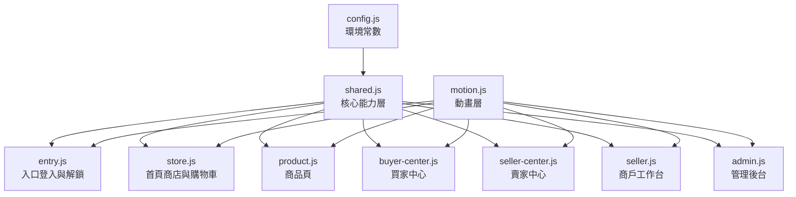

## 1. `config.js`

### 目前責任

- 提供合約地址
- 提供預期鏈 ID
- 提供支付 token 顯示資訊

### 流程圖

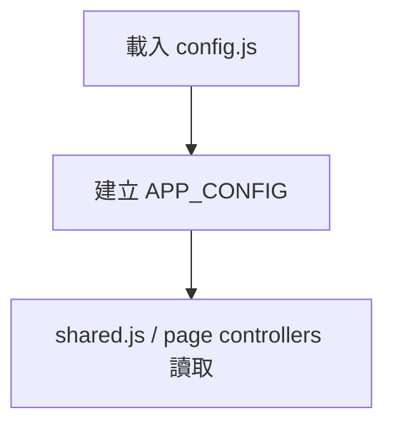

### 收斂演算法

- 用單一 `APP_CONFIG` schema 驗證函式
- 啟動時先驗證必要欄位：
  - `DEFAULT_CONTRACT_ADDRESS`
  - `EXPECTED_CHAIN_ID`
  - `PAYMENT_TOKEN_SYMBOL`
  - `PAYMENT_TOKEN_DECIMALS`
- 若缺值，不直接炸頁面，回傳可讀錯誤狀態給 `entry.js`

## 2. `shared.js`

### 目前責任

- 錢包連接
- Session / `/api/me`
- 合約與 ERC20 實例建立
- API request
- products / orders / reviews / payouts 載入
- seller / admin / buyer dashboard 載入
- localStorage cart / favorites / recently viewed
- page bootstrap

### 流程圖

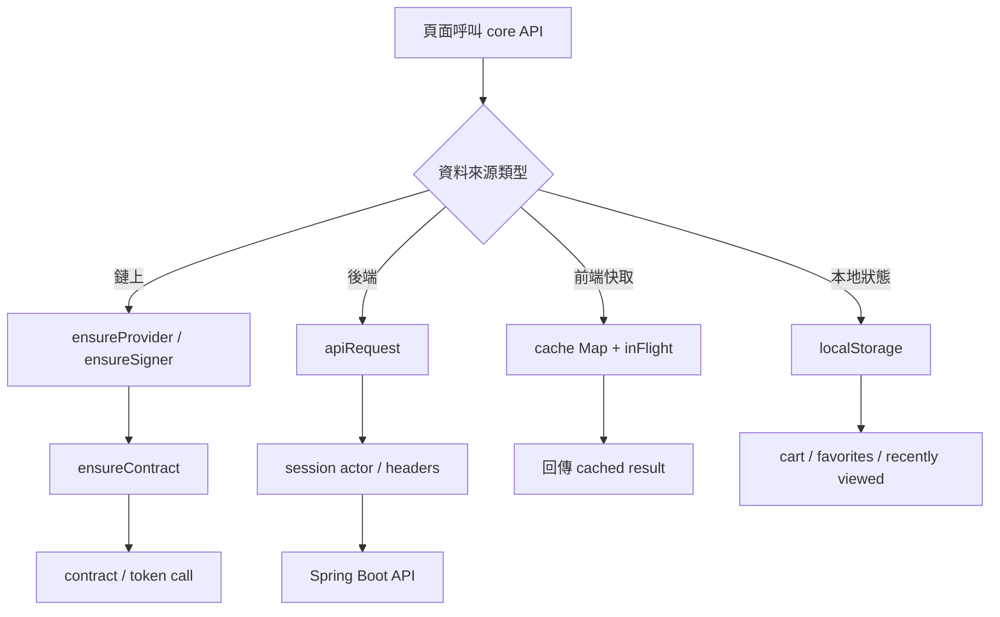

### 收斂演算法

建議把 `shared.js` 收成 5 個穩定子模組：

1. `WalletKernel`
   - `ensureProvider`
   - `ensureSigner`
   - `connectWallet`
   - `switchToExpectedNetwork`

2. `ContractKernel`
   - `ensureContract`
   - `ensurePaymentToken`
   - `ensurePaymentTokenApproval`

3. `ApiKernel`
   - `apiRequest`
   - `getSession`
   - `fetchSessionProfile`

4. `DataKernel`
   - `getProducts`
   - `getOrders`
   - `getReviews`
   - `getPayouts`
   - `get...Dashboard`

5. `LocalKernel`
   - `getCart / saveCart`
   - `toggleFavoriteProduct`
   - `pushRecentlyViewedProduct`

### 穩定與速度優化

- 快取由 `TTL + inFlight dedupe` 升級成：
  - `stale-while-revalidate`
  - 先回舊資料，再背景刷新
- Contract/token 實例建立統一走 `factory`，不要在頁面 controller 裡自己兜 fallback
- `apiRequest` 統一回傳：
  - `data`
  - `errorCode`
  - `message`
- 把 `localStorage` key 集中成 enum，避免字串散落

## 3. `entry.js`

### 目前責任

- 背景粒子動畫
- Start 解鎖入口
- 錢包連接
- Session 顯示
- Block / Escrow / 角色資訊顯示
- 進入商店 gating

### 流程圖

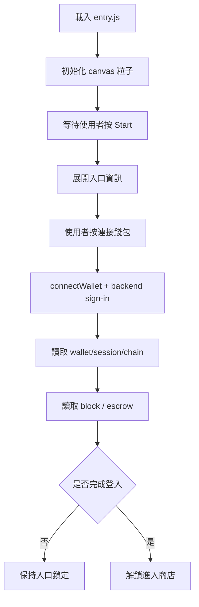

### 收斂演算法

入口頁最適合改成明確狀態機：

- `idle`
- `started`
- `connecting`
- `connected`
- `ready`
- `error`

不要用散落的 `started/account/session` 判斷混在一起。

### 穩定與速度優化

- 粒子動畫和業務邏輯拆開
- `applyDisconnectedState / applyConnectedState` 再拆成純 render
- 所有 UI 更新只吃單一 `entryViewModel`

## 4. `motion.js`

### 目前責任

- 給 panel 加進場動畫
- 給按鈕加 ripple
- 啟用 hover signal
- 啟用 intersection observer

### 流程圖

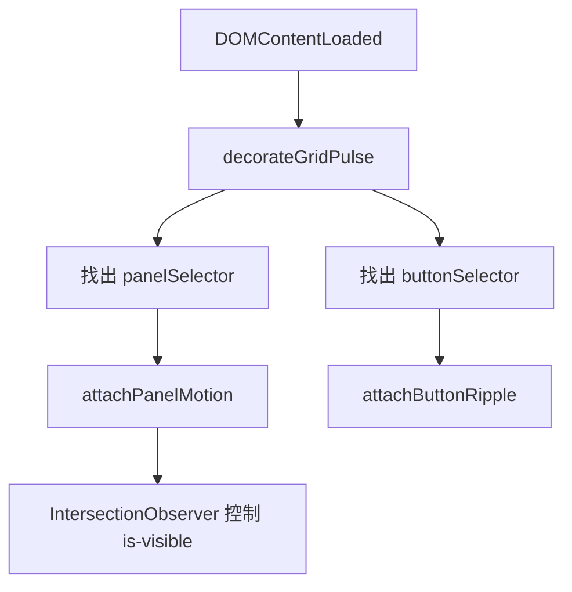

### 收斂演算法

- `motion.js` 應只管純視覺，不碰 layout
- 浮層類元件應列入黑名單：
  - cart drawer
  - orders popover
  - modal
  - bottom floating controls
- 以 `data-motion="panel|button|overlay|none"` 取代 selector 大串字串

### 穩定與速度優化

- 減少 selector 耦合
- 避免動畫層改到 `position / left / right / bottom`
- overlay 類只允許 opacity/transform，不允許 layout 變更

## 5. `store.js`

### 目前責任

- 首頁 hero / 商品列表 / 推薦商品
- Bag / Orders 浮層
- cart render
- orders panel render
- checkout

### 流程圖

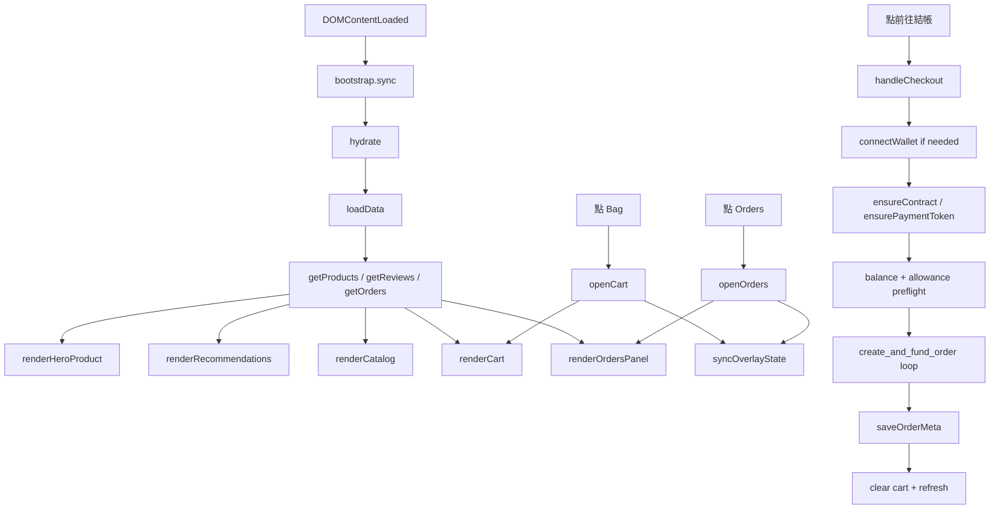

### 收斂演算法

`store.js` 最需要收斂成「單向資料流」：

1. `fetch phase`
   - products
   - reviews
   - orders

2. `derive phase`
   - `filteredProducts`
   - `popularProducts`
   - `topRatedProducts`
   - `cartEntries`
   - `visibleOrders`
   - `summary`

3. `render phase`
   - `renderCatalog(vm.catalog)`
   - `renderCart(vm.cart)`
   - `renderOrdersPanel(vm.orders)`

### 穩定與速度優化

- 目前 `renderCatalog / renderCart / renderOrdersPanel` 都直接讀全域 state  
  建議改成吃 `viewModel`
- checkout 改成：
  - 先批次 preflight
  - 再逐單送交易
  - 每筆交易結果回寫 local progress
- 若之後商品變多，首頁商品網格應改為：
  - 分頁
  - 或 lazy render

## 6. `product.js`

### 目前責任

- 讀 URL 商品 ID
- 讀 products / reviews
- 顯示商品詳情
- 顯示 related products
- 顯示 seller reputation
- 加入購物車 / 收藏

### 流程圖

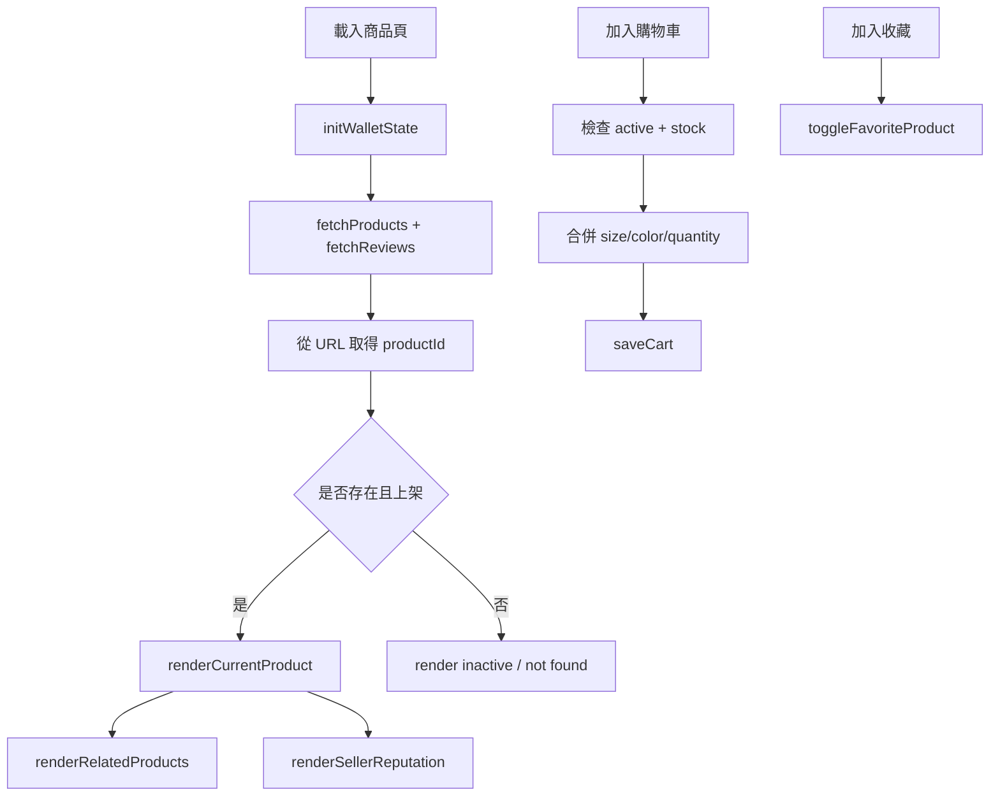

### 收斂演算法

- 商品頁最適合先做單筆資料 selector：
  - `currentProduct`
  - `relatedProducts`
  - `sellerReviews`
- `hydrate()` 不要一次做 render 與查找，改成：
  - `loadPageData()`
  - `buildProductViewModel()`
  - `renderProductPage(vm)`

### 穩定與速度優化

- related products 不要每次 filter 全 products，可先做 `department index`
- seller reviews 可先按 seller 建 `Map<seller, reviews[]>`

## 7. `buyer-center.js`

### 目前責任

- 買家訂單篩選
- 訂單統計
- 收藏 / 最近瀏覽
- 評價紀錄

### 流程圖

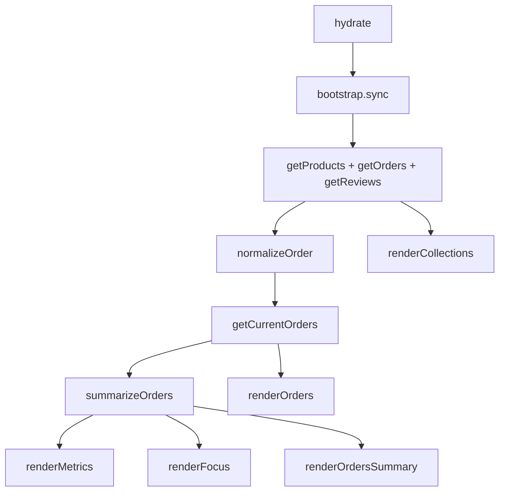

### 收斂演算法

- 以買家地址為 key 建立 `buyerOrderIndex`
- 頁面只處理：
  - `filter`
  - `render`
- 全部統計函式改成 pure functions

### 穩定與速度優化

- `normalizedOrders` 應該由 shared 做一次，不要每頁重複 normalize
- 收藏與最近瀏覽改成 shared selectors

## 8. `seller-center.js`

### 目前責任

- 賣家訂單篩選
- 評價摘要
- 提領摘要
- 月報表卡

### 流程圖

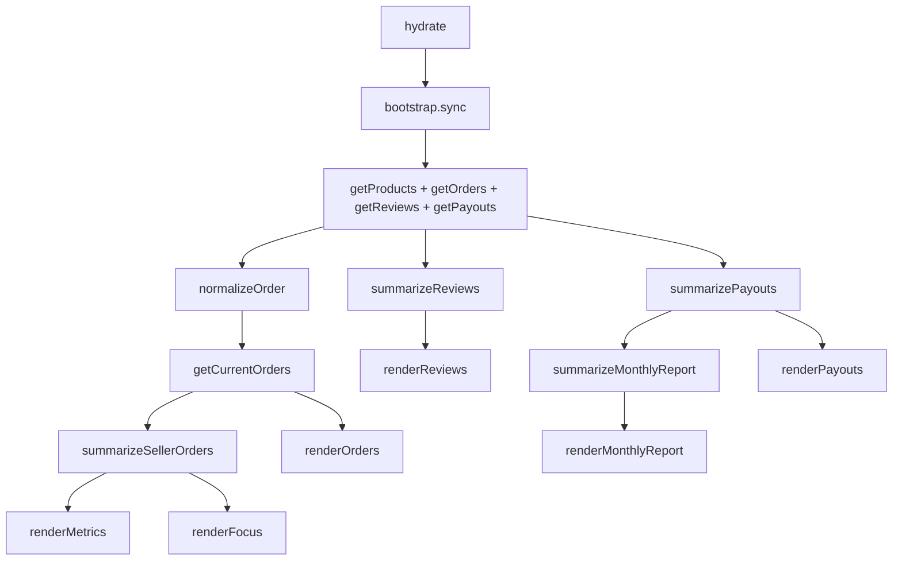

### 收斂演算法

- 由 shared 先提供：
  - `selectSellerOrders(account)`
  - `selectSellerReviews(account)`
  - `selectSellerPayouts(account)`
- 本頁只做 UI 組裝

### 穩定與速度優化

- `summarizeMonthlyReport` 應接真正月份桶，不是 placeholder
- 提領與評論統計改 shared memoized selector

## 9. `seller.js`

### 目前責任

- 賣家工作台 gate
- 商品建立 / 編輯 / 下架 / 刪除
- 圖片上傳
- 商品預覽
- readiness checklist
- governance / alerts

### 流程圖

```mermaid
flowchart TD
    A[hydrate] --> B[bootstrap.sync]
    B --> C[getProducts + getSellerProfile + getSellersStore]
    C --> D[renderAccess]
    C --> E[renderRequests]
    C --> F[renderPreview]
    C --> G[renderGovernance]
    C --> H[renderInventory]

    I[submit form] --> J[buildMeta + parsePrice]
    J --> K{editingProductId?}
    K -->|否| L[createProduct]
    K -->|是| M[updateProduct]
    L --> N[hydrate(true)]
    M --> N

    O[點 inventory action] --> P{edit/toggle/delete}
    P --> Q[startEdit]
    P --> R[setProductActive]
    P --> S[confirmDeleteProduct]
    S --> T[deleteProduct]
```

### 收斂演算法

- `seller.js` 最適合改成表單 reducer：
  - `draftProduct`
  - `editingProductId`
  - `uploadState`
- 商品預覽應該只吃 `draftProduct`
- inventory list / governance / checklist 都吃同一份 seller products viewModel

### 穩定與速度優化

- 先建立 `sellerProducts = products.filter(by seller)` 一次
- governance / alerts / checklist 不要各自重複掃 products
- 圖片上傳狀態改成單獨 state machine：
  - `idle`
  - `uploading`
  - `success`
  - `error`

## 10. `admin.js`

### 目前責任

- 檢查 admin gate
- 顯示 admin dashboard
- 賣家申請審核
- 商品上下架審核
- audit log
- order / payout monitor

### 流程圖

```mermaid
flowchart TD
    A[hydrate] --> B[bootstrap.sync]
    B --> C[getSellerProfile + getAdminDashboard]
    C --> D[render gate]
    D --> E{is admin?}
    E -->|否| F[只顯示 gate 卡]
    E -->|是| G[renderMetrics]
    G --> H[renderSellerRequestList]
    G --> I[renderProductModerationGrid]
    G --> J[renderAuditLog]
    G --> K[renderOrderMonitor]
    G --> L[renderPayoutMonitor]

    M[點核准 / 退回] --> N[approveSellerAccess]
    N --> O[hydrate(true)]

    P[點商品上下架] --> Q[setProductActive]
    Q --> O
```

### 收斂演算法

- `adminDashboard` 後端已經有聚合，前端應完全只讀 dashboard 結果
- 不應在 admin.js 再自己拼資料源

### 穩定與速度優化

- audit / orders / payouts 建議分區 lazy load
- request list 和 product moderation grid 應做局部更新，不必整頁 hydrate

## 建議的全站穩定演算法

## A. 單向資料流

每頁統一走三段：

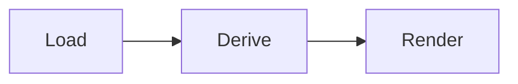

- `Load`: 只抓原始資料
- `Derive`: 只做 selector / summary / filter
- `Render`: 只把 viewModel 畫上去

## B. 單一來源快取

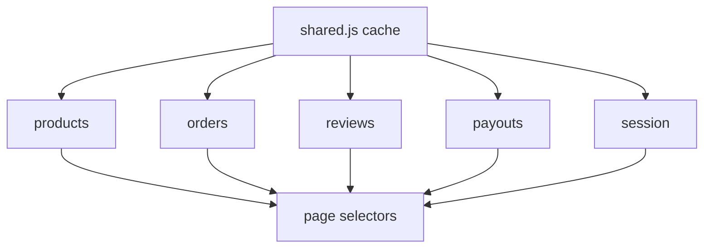

### 建議

- normalize 一次，頁面不要重複 normalize
- dashboard 類 API 優先用後端聚合
- localStorage 僅放：
  - cart
  - favorites
  - recently viewed

## C. Checkout 穩定算法

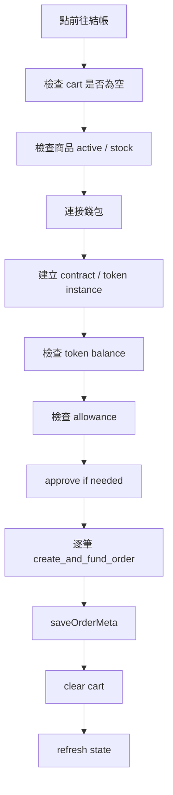

### 建議

- 結帳前一定先 `preflight`
- 鏈上失敗不應先清 cart
- 每筆交易結果應能回報進度

## D. Overlay 穩定算法

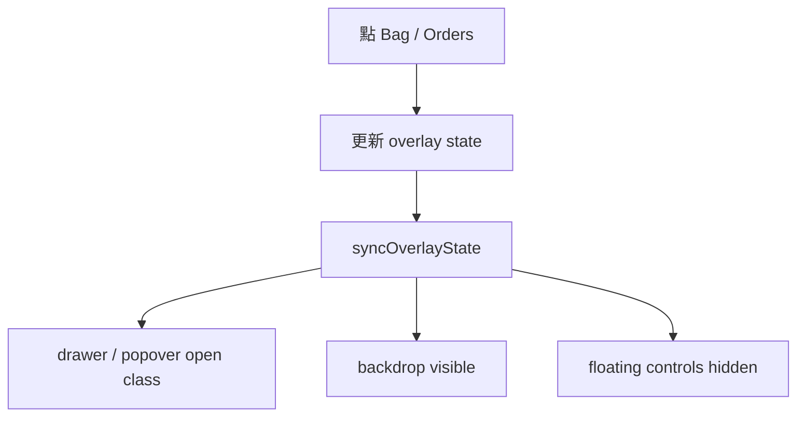

### 建議

- overlay 類元件禁止參與一般 card animation
- 只允許：
  - opacity
  - transform
- 禁止動畫層修改：
  - position
  - left/right/top/bottom

## E. 最值得先做的重構順序

1. `shared.js` 拆 kernel
2. `store.js` 改成 `load -> derive -> render`
3. `seller.js` 改 form reducer + seller products selector
4. `buyer-center.js / seller-center.js` 共用 normalized selectors
5. `motion.js` 改 data attribute 驅動

## 收斂後目標

- 每頁只有 page controller，不再同時當資料層
- shared.js 只做核心能力與 selector
- 後端 dashboard API 負責聚合
- overlay / motion / checkout 三條高風險路徑彼此隔離

